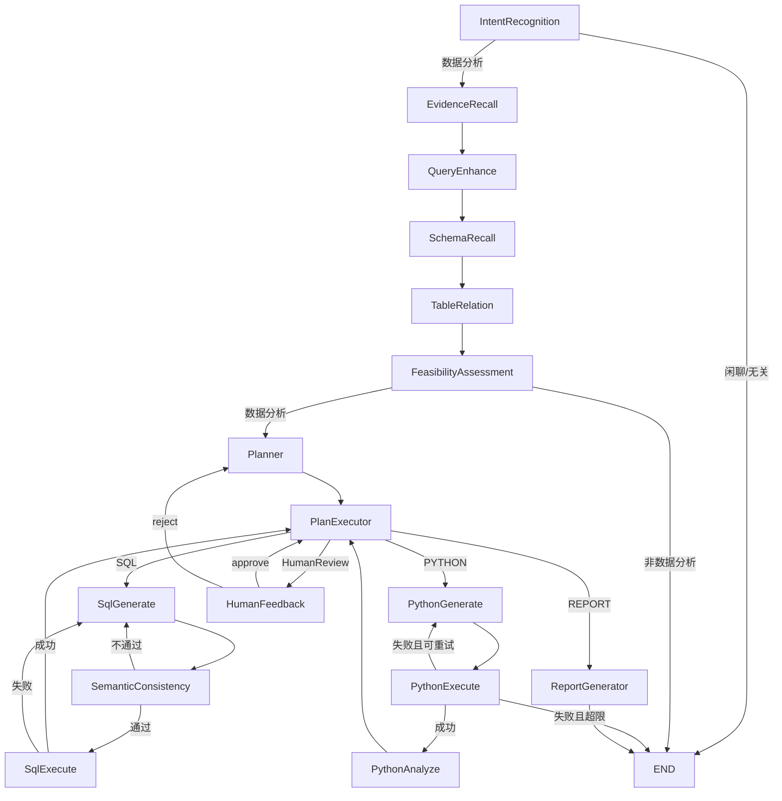

# DataAgent 完整设计文档

> 目标：基于 `spring-ai-alibaba/DataAgent` README 与当前仓库代码，形成一份可落地的系统设计说明，重点覆盖 RAG、知识库、表召回、外键、SQL 生成、Python 节点、人类反馈、语义模型。

## 1. 文档范围与基线

本设计文档覆盖以下模块（以当前仓库代码为准）：

1. 运行时工作流（StateGraph + SSE）
2. RAG 与知识库双通道召回
3. 数据源、表选择、Schema 初始化与向量化
4. 表召回与外键（物理外键 + 逻辑外键）联动
5. SQL 生成、语义校验、执行与重试闭环
6. Python 代码生成、执行、分析与降级
7. Human-in-the-loop（计划审批与回流）
8. 语义模型（Semantic Model）配置与注入
9. 前端交互、关键 API、主要配置项

说明：

1. 官方 README 定位：企业级智能数据分析 Agent，能力包含 Text-to-SQL、Python 深度分析、智能报告、MCP、RAG。
2. 本文不重复快速开始安装步骤，重点解释“系统如何工作”与“为什么这么设计”。

---

## 2. 总体架构

### 2.1 分层视图

1. 前端层：`data-agent-frontend`（会话、SSE 流展示、人工反馈组件）
2. 接入层：`GraphController` 暴露 `/api/stream/search`，返回 SSE
3. 编排层：Spring AI Alibaba Graph（节点 + Dispatcher 条件路由）
4. 能力层：
   - NL2SQL（提示词 + SQL 生成 + 语义一致性）
   - Python 执行器（Docker / Local / AI_SIMULATION）
   - 报告生成器（Markdown + ECharts Option）
5. 数据层：
   - 业务数据库（被分析的数据源）
   - 管理库（agent、datasource、knowledge、semantic_model、logical_relation 等）
   - 向量库（默认 SimpleVectorStore，可扩展）

### 2.2 运行主流程

---

## 3. 核心工作流设计

### 3.1 图编排与状态

核心编排位于 `DataAgentConfiguration`，节点通过 `addNode` 注册、通过 `addConditionalEdges` 路由。状态键集中在 `Constant`。

关键点：

1. 图编译时设置 `interruptBefore(HUMAN_FEEDBACK_NODE)`，使人类反馈可中断/恢复。
2. 状态键大多使用 `KeyStrategy.REPLACE`，避免旧值污染后续节点。
3. `RunnableConfig.threadId` 作为会话级上下文主键，驱动多轮与恢复。

### 3.2 多轮上下文

`MultiTurnContextManager` 维护：

1. `history`：最近 N 轮（默认 `maxturnhistory`）
2. `pendingTurns`：当前轮尚未结束时缓存 planner 输出
3. `restartLastTurn`：计划被 reject 时回退最近一轮并重做

这使得意图识别、问题增强、evidence 重写具备多轮语境能力。

---

## 4. RAG 与知识库设计

### 4.1 双通道知识召回

Evidence 节点会并行召回两类知识：

1. Business Knowledge（业务术语）
2. Agent Knowledge（文档 / QA / FAQ）

流程：

1. 先用 `evidence-query-rewrite` 将用户问题改写为 standalone query
2. 分别调用向量检索：
   - `vectorType=businessTerm`
   - `vectorType=agentKnowledge`
3. 将结果格式化为 evidence 文本注入后续节点（QueryEnhance / SQL / Planner）

### 4.2 动态过滤（Dynamic Filter）

`DynamicFilterService` 不只按 `agentId + vectorType` 过滤，还会联查 MySQL 的 `is_recall`：

1. 业务术语：仅 `business_knowledge.is_recall=1` 的 ID 会入检索过滤
2. 智能体知识：仅 `agent_knowledge.is_recall=1` 的 ID 会入检索过滤
3. 若某类知识全部不可召回，直接返回空结果，避免噪声

### 4.3 混合检索（可选）

`spring.ai.alibaba.data-agent.vector-store.enable-hybrid-search=true` 时：

1. 向量检索 + 关键词检索并行执行
2. 融合策略默认 RRF（`RrfFusionStrategy`）
3. Elasticsearch 实现支持关键词检索（`match content` + filter）
4. 非 ES 默认策略关键词分支为空，等价“向量优先”

---

## 5. 知识库生命周期

### 5.1 Agent Knowledge（文档/QA/FAQ）

1. 创建知识后发出 `AgentKnowledgeEmbeddingEvent`
2. `AgentKnowledgeEventListener` 在事务提交后异步处理
3. `AgentKnowledgeResourceManager`：
   - DOCUMENT：Tika 读文件 + TextSplitter 分块 + metadata 注入 + 向量入库
   - QA/FAQ：直接 question 入向量，answer 仍在关系库
4. 删除采用软删除 + 异步清理向量/文件，`is_resource_cleaned` 追踪

### 5.2 Business Knowledge

1. 新增/修改时同步向量
2. recall 开关只改关系库，检索时由 DynamicFilter 控制可见性
3. 支持 retry embedding

### 5.3 分块策略

由 `TextSplitterFactory` 按类型选择（token/recursive/sentence/semantic/paragraph），并提供默认降级。

---

## 6. 表召回与 Schema 设计

### 6.1 数据源与表选择

先在 Agent 维度选择并激活 datasource，再选择可分析表（`agent_datasource_tables`）。初始化时只向量化被选表。

### 6.2 Schema 初始化

`SchemaServiceImpl.schema` 执行：

1. 清理该 datasource 旧 table/column 向量
2. 从真实数据库读取表、列、主键、外键、样本值
3. 转为文档：
   - table 文档 metadata 包含 `name/description/foreignKey/primaryKey/...`
   - column 文档 metadata 包含 `tableName/name/type/samples/...`
4. 批量入向量库

### 6.3 表召回实现细节

`SchemaRecallNode`：

1. 按 datasource 召回 table 文档
2. 提取表名后批量取对应 column 文档
3. 无激活数据源或无表时提前终止

注意：当前 `getTableDocumentsByDatasource` 构造了带 query 的 `SearchRequest`，但实际调用 `getDocumentsOnlyByFilter`（默认 query=default），表现为“按过滤条件取表”，而不是基于 query 的相似度召回。这是当前实现特征，后续可优化。

---

## 7. 外键与表关系设计

### 7.1 物理外键

来源：数据库元数据 `showForeignKeys`，格式化为：

`源表.源列=目标表.目标列`

并写入 table 文档 metadata 的 `foreignKey`（多个用 `、` 分隔）。

### 7.2 逻辑外键

来源：`logical_relation` 表（用户可在管理端维护）。

字段核心：

1. `source_table_name/source_column_name`
2. `target_table_name/target_column_name`
3. `relation_type`（1:1,1:N,N:1）
4. `description`

在 `TableRelationNode` 中：

1. 取当前 agent 激活 datasource 的逻辑外键
2. 只保留“与当前召回表相关”的关系
3. 格式化并合并进 `SchemaDTO.foreignKeys`

### 7.3 外键驱动补全

`buildSchemaFromDocuments` 会从 foreign key 中提取关联表/列：

1. 若发现“外键关联了未召回表”，自动补拉缺失表文档
2. 同步补拉这些表的列文档
3. 形成更完整的 JOIN 候选空间，降低 SQL 生成漏 JOIN 风险

---

## 8. 语义模型（Semantic Model）设计

### 8.1 数据结构

`semantic_model` 核心字段：

1. `table_name`, `column_name`（物理层）
2. `business_name`, `synonyms`, `business_description`（业务语义层）
3. `data_type`, `status`

### 8.2 注入时机

在 `TableRelationNode` 完成最终表筛选后：

1. 按 `agentId + tableNames` 查询语义模型
2. `PromptHelper.buildSemanticModelPrompt(...)` 生成语义提示
3. 写入状态 `GENEGRATED_SEMANTIC_MODEL_PROMPT`，供 Planner 与 SQL 生成使用

### 8.3 管理能力

`SemanticModelController` 支持：

1. CRUD、启停、批量导入
2. Excel 模板下载与导入

---

## 9. SQL 生成与执行闭环

### 9.1 Planner -> Step Instruction

Planner 输出结构化 plan（JSON），每步声明 `tool_to_use + tool_parameters`。SQL 节点不直接吃原始 query，而是吃“当前执行步骤 instruction”。

### 9.2 SQL 生成

`SqlGenerateNode` 逻辑：

1. 初次：`new-sql-generate` prompt
2. SQL 执行失败重试：`sql-error-fixer` prompt
3. 语义不一致重试：同样走修复路径
4. 超过 `maxSqlRetryCount` 则终止

### 9.3 语义一致性

`SemanticConsistencyNode` 调用 `semantic-consistency` prompt，仅校验“当前步骤目标是否匹配”，通过后才执行 SQL。

### 9.4 SQL 执行

`SqlExecuteNode`：

1. 动态获取 agent 绑定数据源连接
2. 执行 SQL，写入 step 结果
3. 成功则推进 `PLAN_CURRENT_STEP`
4. 失败写 `SQL_REGENERATE_REASON=sqlExecute(...)` 回流重生 SQL
5. 可选调用 LLM 生成可视化配置（`DisplayStyleBO`）

---

## 10. Python 节点设计

### 10.1 节点链路

`PythonGenerate -> PythonExecute -> PythonAnalyze -> PlanExecutor`

### 10.2 Python 生成

输入包含：

1. 当前步骤 instruction
2. Schema 信息
3. SQL 结果样本
4. 上次失败代码与错误（若重试）

输出必须是可执行 Python 代码（严格无 markdown 包裹）。

### 10.3 执行器模式

由 `code-executor.code-pool-executor` 决定：

1. `DOCKER`（推荐生产）
2. `LOCAL`（本地 Python 运行）
3. `AI_SIMULATION`（LLM 模拟执行）

### 10.4 重试与降级

1. Python 失败时按 `python-max-tries-count` 重试
2. 超限进入 `PYTHON_FALLBACK_MODE`
3. `PythonAnalyzeNode` 在降级模式输出固定兜底提示并继续主流程

---

## 11. 人类反馈（Human-in-the-loop）设计

### 11.1 后端机制

1. 图在 `HUMAN_FEEDBACK_NODE` 前中断（`interruptBefore`）
2. 首次运行时 `humanFeedback=true` 会设置 `HUMAN_REVIEW_ENABLED`
3. `PlanExecutorNode` 检测到后路由到 `HUMAN_FEEDBACK_NODE`
4. 用户提交反馈后：
   - approve：回 `PLAN_EXECUTOR_NODE` 继续执行
   - reject：回 `PLANNER_NODE` 重规划，`PLAN_REPAIR_COUNT++`
5. 修复次数上限后终止

### 11.2 前端交互

1. `GraphRequest` 关键字段：`threadId/humanFeedback/humanFeedbackContent/rejectedPlan`
2. `HumanFeedback.vue` 提供“通过/不通过计划”按钮与文本反馈
3. 使用同一 `threadId` 发起恢复请求，实现断点续跑

---

## 12. 报告生成设计

`ReportGeneratorNode` 汇总：

1. 用户原始需求 + 计划思路
2. 每步执行结果（含 SQL 与 Python 分析）
3. 最终 `summary_and_recommendations`

输出为 Markdown（可带 `echarts` 代码块），并清理中间状态（如 `SQL_EXECUTE_NODE_OUTPUT/PLANNER_NODE_OUTPUT`）。

---

## 13. 关键配置项（建议重点关注）

1. `spring.ai.alibaba.data-agent.vector-store.*`
2. `spring.ai.alibaba.data-agent.max-sql-retry-count`
3. `spring.ai.alibaba.data-agent.code-executor.*`
4. `spring.ai.alibaba.data-agent.llm-service-type`（STREAM/BLOCK）
5. `spring.ai.vectorstore.type`（simple/其他扩展向量库）

默认 `application.yml` 下 Python 执行器为 `local`；生产建议改 `docker`。

---

## 14. 关键接口总览（与本设计最相关）

1. 运行入口：`GET /api/stream/search`
2. 数据源管理：`/api/datasource/**`
3. Agent 数据源绑定/初始化：`/api/agent/{agentId}/datasources/**`
4. 逻辑外键：`/api/datasource/{id}/logical-relations/**`
5. 语义模型：`/api/semantic-model/**`
6. 知识库与业务知识：`/api/...knowledge...`（按对应 Controller）

---

## 15. 当前实现特点与风险提示

### 15.1 当前实现特点

1. 表召回阶段当前更偏“过滤取表”而非 query 相似度排序（见第 6.3）
2. 计划审批与恢复通过 threadId + graph state update 实现，前后端耦合度较高
3. Python 失败后有降级路径，保证流程可继续但分析深度会下降

### 15.2 残余不确定性与建议

1. 向量检索效果依赖 embedding 模型一致性；更换 embedding 后需重建向量
2. 逻辑外键若配置质量低，会把噪声关系写进 prompt，影响 SQL 质量
3. 语义模型字段描述过泛时，收益有限；建议优先覆盖“高歧义术语字段”

---

## 16. 代码证据索引（主要）

1. 图编排：`data-agent-management/src/main/java/com/alibaba/cloud/ai/dataagent/config/DataAgentConfiguration.java`
2. 流式入口：`data-agent-management/src/main/java/com/alibaba/cloud/ai/dataagent/controller/GraphController.java`
3. 流式与中断恢复：`data-agent-management/src/main/java/com/alibaba/cloud/ai/dataagent/service/graph/GraphServiceImpl.java`
4. 多轮上下文：`data-agent-management/src/main/java/com/alibaba/cloud/ai/dataagent/service/graph/Context/MultiTurnContextManager.java`
5. RAG 节点：`data-agent-management/src/main/java/com/alibaba/cloud/ai/dataagent/workflow/node/EvidenceRecallNode.java`
6. 动态过滤：`data-agent-management/src/main/java/com/alibaba/cloud/ai/dataagent/service/vectorstore/DynamicFilterService.java`
7. 向量服务：`data-agent-management/src/main/java/com/alibaba/cloud/ai/dataagent/service/vectorstore/AgentVectorStoreServiceImpl.java`
8. Schema 与外键：`data-agent-management/src/main/java/com/alibaba/cloud/ai/dataagent/service/schema/SchemaServiceImpl.java`
9. 表关系与语义模型注入：`data-agent-management/src/main/java/com/alibaba/cloud/ai/dataagent/workflow/node/TableRelationNode.java`
10. SQL 生成：`data-agent-management/src/main/java/com/alibaba/cloud/ai/dataagent/workflow/node/SqlGenerateNode.java`
11. 语义校验：`data-agent-management/src/main/java/com/alibaba/cloud/ai/dataagent/workflow/node/SemanticConsistencyNode.java`
12. SQL 执行：`data-agent-management/src/main/java/com/alibaba/cloud/ai/dataagent/workflow/node/SqlExecuteNode.java`
13. Python 三节点：`PythonGenerateNode.java` / `PythonExecuteNode.java` / `PythonAnalyzeNode.java`
14. 人类反馈：`HumanFeedbackNode.java` / `HumanFeedbackDispatcher.java`
15. 语义模型服务：`data-agent-management/src/main/java/com/alibaba/cloud/ai/dataagent/service/semantic/SemanticModelServiceImpl.java`
16. 前端请求与反馈：`data-agent-frontend/src/services/graph.ts`、`data-agent-frontend/src/components/run/HumanFeedback.vue`、`data-agent-frontend/src/views/AgentRun.vue`
17. 元数据与表结构：`data-agent-management/src/main/resources/sql/schema.sql`
18. Prompt 模板：`data-agent-management/src/main/resources/prompts/*.txt`

---

## 17. 结论

DataAgent 当前实现并非“单点 NL2SQL”，而是一个以 Graph 编排为核心的多阶段智能分析系统：

1. 用 RAG 解决业务语义与术语映射
2. 用表召回 + 外键补全解决 schema 复杂性
3. 用 SQL 生成-校验-执行闭环提高正确率
4. 用 Python 节点承接复杂计算与分析
5. 用 Human-in-the-loop 保证关键场景可控
6. 用语义模型提供业务语义对齐能力

这套设计适合企业场景中的“可解释、可干预、可扩展”的数据分析 Agent 落地。
